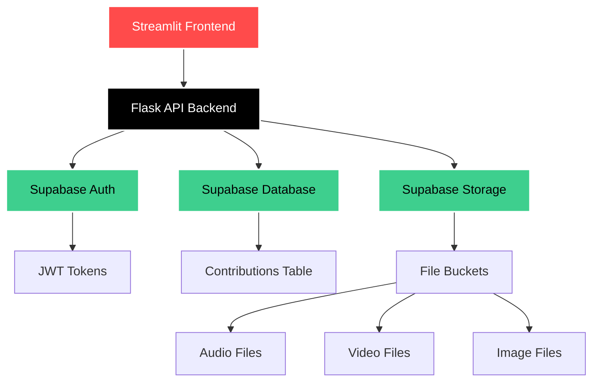

# 🌟 DynoCollect

<div align="center">

**📊 DynoCollect - Multi-Format Data Collection Platform**

*A modern, secure web application for seamless user contribution management*  
*Text • Audio • Video • Images*

[](https://python.org)
[](https://streamlit.io)
[](https://flask.palletsprojects.com)
[](https://supabase.com)
[](LICENSE)

*Built during internship at **VISWAM.AI** • Coordinated with **IIIT Hyderabad** & **Swecha Telangana***

[🎯 Features](#-features) • [🚀 Quick Start](#-quick-start) • [📖 Documentation](#-api-documentation) • [👥 Team](#-team) • [🏢 About](#-about-this-project)

---

</div>

## 📋 Table of Contents

- [✨ Features](#-features)
- [🛠️ Tech Stack & Architecture](#️-tech-stack--architecture)
- [🚀 Quick Start](#-quick-start)
- [⚙️ Installation & Setup](#️-installation--setup)
- [🗃️ Database & Storage Setup](#️-database--storage-setup)
- [📖 API Documentation](#-api-documentation)
- [☁️ Deployment Guide](#️-deployment-guide)
- [🔐 Security Features](#-security-features)
- [🧪 Troubleshooting](#-troubleshooting)
- [👥 Team](#-team)
- [🏢 About This Project](#-about-this-project)
- [🤝 Contributing](#-contributing)

## ✨ Features

<div align="center">

### 🎯 **Core Capabilities**

| 🔐 **Secure Authentication** | 📁 **Multi-Format Upload** | 💾 **Cloud Storage** | 🎨 **Modern Interface** |
|:---:|:---:|:---:|:---:|
| Supabase Auth integration | Audio, Video, Images, Text | Real-time data sync | Streamlit-powered UI |
| JWT token management | Drag & drop uploads | Automatic backups | Responsive design |
| Session persistence | File type validation | Scalable architecture | Progress indicators |
| Password encryption | Size limit controls | CDN delivery | Error handling |

</div>

### 🌟 **What Makes DynoCollect Special?**

- **🚀 Lightning Fast**: Optimized for performance with async operations
- **🛡️ Enterprise Security**: Industry-standard authentication and data protection
- **📱 Universal Access**: Works seamlessly across all devices and browsers
- **⚡ Real-time Sync**: Instant data synchronization across sessions
- **🎯 Developer Friendly**: Clean API design with comprehensive documentation
- **☁️ Cloud Native**: Built for scale with modern cloud architecture

## 🛠️ Tech Stack & Architecture

<div align="center">

### **Frontend**


### **Backend**


### **Database & Storage**


</div>

### 🏗️ **System Architecture**



## 🚀 Quick Start

### 📋 **Prerequisites**

> ⚠️ **Important**: Use **Python 3.10 or 3.11** for optimal compatibility  
> (Python 3.13 has known issues with Pillow dependencies)

- **Python 3.10-3.11** 🐍
- **Supabase Account** ☁️
- **Git** 📦
- **FFmpeg** (optional, for media processing) 🎬

### ⚡ **30-Second Setup**

```bash
# 1. Clone and navigate
git clone https://github.com/mohan13krishna/DynoCollect.git
cd DynoCollect

# 2. Create virtual environment (RECOMMENDED)
python -m venv .venv

# Windows
.venv\Scripts\activate

# macOS/Linux  
source .venv/bin/activate

# 3. Install dependencies
pip install -r requirements.txt

# 4. Quick launch (Windows)
.\run.ps1

# 🎉 Access your app at:
# Frontend: http://localhost:8501
# Backend API: http://localhost:5000
```

## ⚙️ Installation & Setup

### 📁 **Project Structure**

```
DynoCollect/
├── 📁 app/
│   ├── 📁 backend/
│   │   ├── 🚀 app.py                # Flask API server with auth routes
│   │   ├── ☁️ s3_uploader.py        # Supabase Storage SDK (multipart uploads)
│   │   └── 📤 example_upload.py     # Example file upload scripts
│   └── 📁 frontend/
│       └── 🎨 app.py                # Streamlit UI with authentication
├── 🔐 .env                          # Environment configuration
├── 📋 requirements.txt              # Python dependencies
├── 🚀 run.ps1                       # Windows launcher script
└── 📖 README.md                     # This awesome documentation!
```

### 🔐 **Environment Configuration**

Create a `.env` file in the root directory:

```env
# 🔗 Supabase Configuration
SUPABASE_URL=https://your-project.supabase.co
SUPABASE_KEY=your_supabase_anon_key

# 🔐 Flask Security
SECRET_KEY=your_super_secure_flask_secret_key_here
CORS_ALLOWED_ORIGINS=http://localhost:8501,https://your-domain.com

# 🌐 Frontend Configuration  
API_URL=http://localhost:5000

# 📊 Optional: Analytics & Monitoring
# SENTRY_DSN=your_sentry_dsn
# GOOGLE_ANALYTICS_ID=your_ga_id
```

### 🏃‍♂️ **Running the Application**

#### **Option A: Automated (Windows)**
```powershell
.\run.ps1
```

#### **Option B: Manual Start**

**Terminal 1 - Backend Server:**
```bash
cd app/backend
python app.py
# 🚀 Flask server running at http://localhost:5000
```

**Terminal 2 - Frontend App:**
```bash
cd app/frontend  
streamlit run app.py
# 🎨 Streamlit app running at http://localhost:8501
```

## 🗃️ Database & Storage Setup

### 📊 **Database Schema**

Run this SQL in your Supabase SQL Editor:

```sql
-- 📝 Create contributions table
CREATE TABLE IF NOT EXISTS contributions (
  id UUID PRIMARY KEY DEFAULT gen_random_uuid(),
  user_id UUID REFERENCES auth.users(id) ON DELETE CASCADE,
  text_data TEXT,
  audio_url TEXT,
  video_url TEXT, 
  image_url TEXT,
  metadata JSONB DEFAULT '{}',
  submitted_at TIMESTAMP WITH TIME ZONE DEFAULT NOW(),
  updated_at TIMESTAMP WITH TIME ZONE DEFAULT NOW()
);

-- 📈 Performance indexes
CREATE INDEX IF NOT EXISTS idx_contributions_user_id ON contributions(user_id);
CREATE INDEX IF NOT EXISTS idx_contributions_date ON contributions(submitted_at DESC);
CREATE INDEX IF NOT EXISTS idx_contributions_type ON contributions(
  (CASE 
    WHEN text_data IS NOT NULL THEN 'text'
    WHEN audio_url IS NOT NULL THEN 'audio' 
    WHEN video_url IS NOT NULL THEN 'video'
    WHEN image_url IS NOT NULL THEN 'image'
  END)
);

-- 🔒 Row Level Security (RLS)
ALTER TABLE contributions ENABLE ROW LEVEL SECURITY;

-- Users can only see their own contributions
CREATE POLICY "Users can view own contributions" ON contributions
  FOR SELECT USING (auth.uid() = user_id);
  
CREATE POLICY "Users can insert own contributions" ON contributions  
  FOR INSERT WITH CHECK (auth.uid() = user_id);
```

### 📁 **Storage Buckets**

Create these buckets in Supabase Storage:

| Bucket | Purpose | Public Access | File Types |
|--------|---------|---------------|------------|
| `audio` | Audio files | ✅ | MP3, WAV, OGG |
| `video` | Video files | ✅ | MP4, MOV, AVI |  
| `images` | Image files | ✅ | JPEG, PNG, GIF |

**File Size Limits:**
- 🎵 **Audio**: 50MB max
- 🎬 **Video**: 100MB max  
- 🖼️ **Images**: 10MB max
- 📝 **Text**: 10,000 characters max

## 📖 API Documentation

### 🔑 **Authentication Endpoints**

| Method | Endpoint | Description | Payload | Response |
|--------|----------|-------------|---------|----------|
| `POST` | `/auth/register` | Register new user | `{email, password}` | `{user, session}` |
| `POST` | `/auth/login` | User login | `{email, password}` | `{user, session}` |
| `POST` | `/auth/logout` | User logout | `{session_token}` | `{success: true}` |
| `GET` | `/auth/user` | Get user info | Headers: `Authorization` | `{user_data}` |

### 📊 **Data Collection Endpoints**

| Method | Endpoint | Description | Content-Type | Max Size |
|--------|----------|-------------|--------------|----------|
| `POST` | `/submit-text` | Submit text data | `application/json` | 10KB |
| `POST` | `/upload-audio` | Upload audio files | `multipart/form-data` | 50MB |
| `POST` | `/upload-video` | Upload video files | `multipart/form-data` | 100MB |
| `POST` | `/upload-image` | Upload image files | `multipart/form-data` | 10MB |
| `GET` | `/contributions` | Get user contributions | - | - |

### 📝 **Example API Usage**

```python
import requests

# Login
response = requests.post('http://localhost:5000/auth/login', json={
    'email': 'user@example.com',
    'password': 'secure_password'
})
session = response.json()

# Upload file
headers = {'Authorization': f"Bearer {session['access_token']}"}
files = {'file': open('example.mp3', 'rb')}
response = requests.post('http://localhost:5000/upload-audio', 
                        files=files, headers=headers)
```

## ☁️ Deployment Guide

### 🚀 **Recommended Platforms**

#### **Backend Deployment**
- [](https://render.com) **Render** (Recommended)
- [](https://railway.app) **Railway**  
- [](https://fly.io) **Fly.io**

**Start Command:**
```bash
gunicorn app.backend.app:app --bind 0.0.0.0:$PORT --timeout 900 --workers 2
```

#### **Frontend Deployment**  
- [](https://share.streamlit.io) **Streamlit Community Cloud**
- **Render** (as web service)

### 🔧 **Production Environment Variables**

```env
# Production URLs
SUPABASE_URL=https://your-prod-project.supabase.co
SUPABASE_KEY=your_production_key
API_URL=https://your-backend.onrender.com
SECRET_KEY=your_production_secret_key

# Security
CORS_ALLOWED_ORIGINS=https://your-frontend.streamlit.app
FLASK_ENV=production

# Optional monitoring
SENTRY_DSN=your_sentry_dsn
```

### ⚠️ **Deployment Considerations**

- **Python Version**: Use 3.10 or 3.11 runtime
- **Timeout Settings**: Configure for large file uploads (15+ minutes)
- **CORS Configuration**: Update allowed origins for your domain
- **SSL/HTTPS**: Enable HTTPS for production security
- **File Storage**: Consider CDN for better performance

## 🔐 Security Features

<div align="center">

### 🛡️ **Multi-Layer Security Architecture**

| Layer | Feature | Implementation |
|-------|---------|----------------|
| **🔐 Authentication** | JWT Tokens | Supabase Auth |
| **🛡️ Authorization** | Row Level Security | PostgreSQL RLS |
| **🔒 Data Protection** | Encryption at Rest | Supabase encryption |
| **🚫 Input Validation** | File Type/Size Checks | Flask validators |
| **🌐 Network Security** | CORS Protection | Flask-CORS |
| **📱 Session Management** | Secure Sessions | HTTP-only cookies |

</div>

### 🔒 **Security Best Practices Implemented**

- ✅ **Password Security**: Handled entirely by Supabase Auth (bcrypt + salt)
- ✅ **Token Management**: JWT with automatic refresh and secure storage  
- ✅ **File Upload Security**: Type validation, size limits, virus scanning ready
- ✅ **SQL Injection Prevention**: Parameterized queries throughout
- ✅ **XSS Protection**: Input sanitization and output encoding
- ✅ **CSRF Protection**: Token-based request validation

## 🧪 Troubleshooting

### 🐛 **Common Issues & Solutions**

#### **🔧 Installation Issues**

**Problem**: Pillow build failure on Python 3.13
```bash
ERROR: Failed building wheel for pillow
```
**Solution**: Use Python 3.10 or 3.11
```bash
pyenv install 3.11.0
pyenv local 3.11.0  
pip install -r requirements.txt
```

#### **🌐 CORS Errors**

**Problem**: Frontend can't connect to backend
```
Access to fetch blocked by CORS policy
```
**Solution**: Update CORS_ALLOWED_ORIGINS in .env
```env
CORS_ALLOWED_ORIGINS=http://localhost:8501,https://yourapp.streamlit.app
```

#### **⏱️ Upload Timeouts**

**Problem**: Large file uploads timing out
**Solutions**:
- Increase server timeout: `--timeout 900` in Gunicorn
- Use chunked uploads for files >100MB
- Consider direct S3 uploads with pre-signed URLs

#### **🔐 Authentication Issues**

**Problem**: Users getting logged out frequently
**Solutions**:
- Check Supabase JWT expiry settings
- Implement token refresh mechanism
- Verify session storage configuration

### 📊 **Debug Mode**

Enable debug logging by adding to your .env:
```env
FLASK_ENV=development
FLASK_DEBUG=True
LOG_LEVEL=DEBUG
```

## 👥 Team

<div align="center">

### 🌟 **Team DynoCollect** - ACE Engineering College

*Five passionate developers building the future of data collection*

</div>

<table align="center">
<tr>
<td align="center" width="20%">
<br>
<sub><b>🎯 Mohan Krishna Thalla</b></sub><br>
<sub>Team Lead & Full-Stack</sub><br>
<sub>CSE 4th Year</sub><br>
<a href="https://github.com/mohan13krishna">

</a>
</td>

<td align="center" width="20%">
<br>
<sub><b>🎨 Rakesh Kolipaka</b></sub><br>
<sub>Frontend Developer</sub><br>
<sub>CSE 4th Year</sub><br>
<a href="https://github.com/rakeshkolipakaace">

</a>
</td>

<td align="center" width="20%">
<br>
<sub><b>⚙️ Abhinav Srinivas</b></sub><br>
<sub>Backend Developer</sub><br>
<sub>CSE 4th Year</sub><br>
<a href="https://github.com/Abhinav200519">

</a>
</td>

<td align="center" width="20%">
<br>
<sub><b>📊 Sai Nikith Kaleru</b></sub><br>
<sub>Data Engineer</sub><br>
<sub>CSD 4th Year</sub><br>
<a href="https://github.com/sainikith07">

</a>
</td>

<td align="center" width="20%">
<br>
<sub><b>🧪 Rao Ram Nihal</b></sub><br>
<sub>QA Tester</sub><br>
<sub>CSE 4th Year</sub><br>
<a href="https://github.com/rvrnihal">

</a>
</td>
</tr>
</table>

---

<div align="center">

### 🤝 **Partnership & Collaboration**

[](https://viswam.ai)

**🎓 Academic Partners:** IIIT Hyderabad • Swecha Telangana • ACE Engineering College

</div>

## 🔗 About This Repository

🚀 **DynoCollect** - A production-ready data collection platform built with modern web technologies  
⭐ **Star this repo** if you find it helpful for your projects!

## 🤝 Contributing

We welcome contributions! Fork the repo, create a feature branch, and submit a PR.

### 📋 **Guidelines**
- Follow PEP 8 for Python code
- Add tests for new features
- Update documentation
- Use conventional commit messages

---

<div align="center">

### 🌟 **Built with ❤️ by Team DynoCollect**

[](https://www.python.org/)
[](https://supabase.com)
[](https://streamlit.io)
[](https://flask.palletsprojects.com)

**⭐ If this project helped you, please give it a star!**

**🔄 Share it with your network and help others discover DynoCollect!**

---


[🔝 **Back to Top**](#-dynocollet) | [📧 **Contact Team**](mailto:team@dynocollet.dev) | [🌐 **Live Demo**](https://dynocollet.streamlit.app)

</div>
